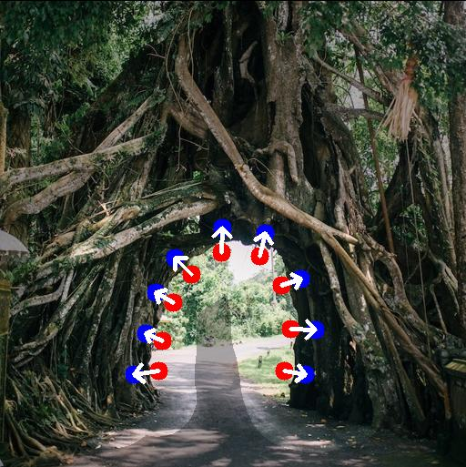
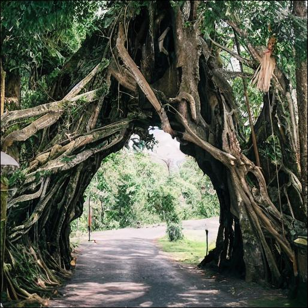
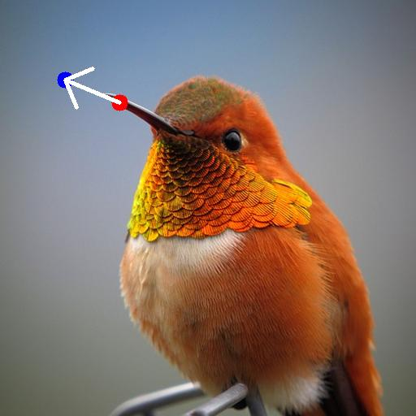
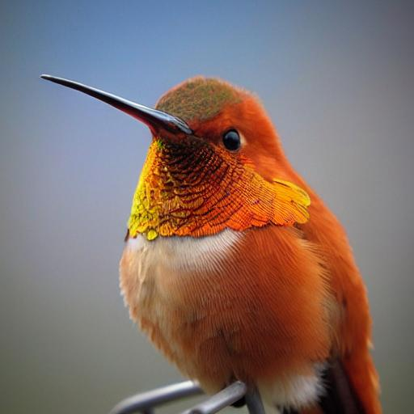
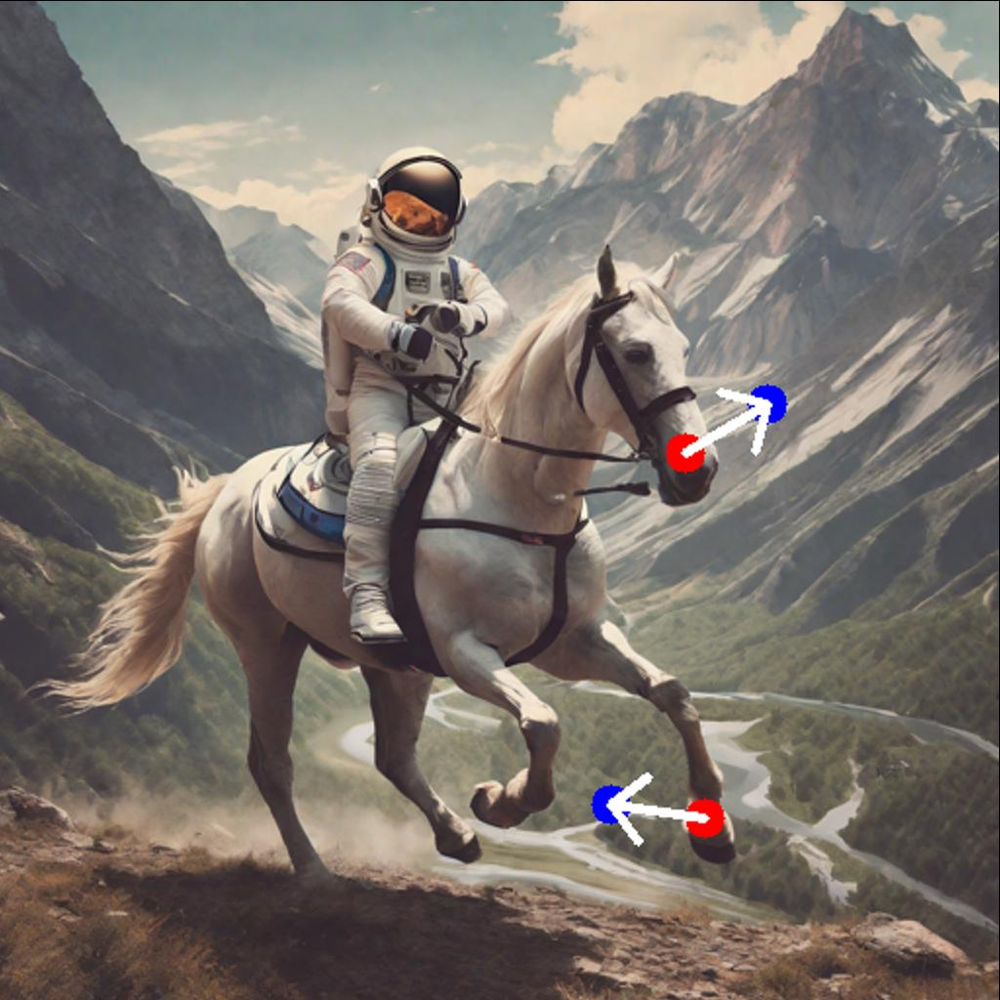
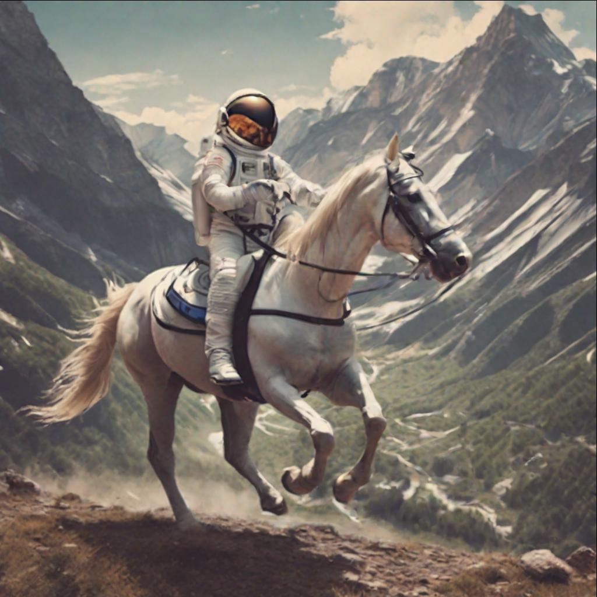
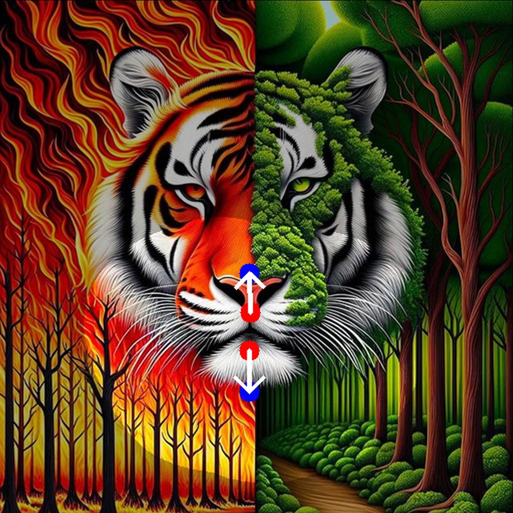
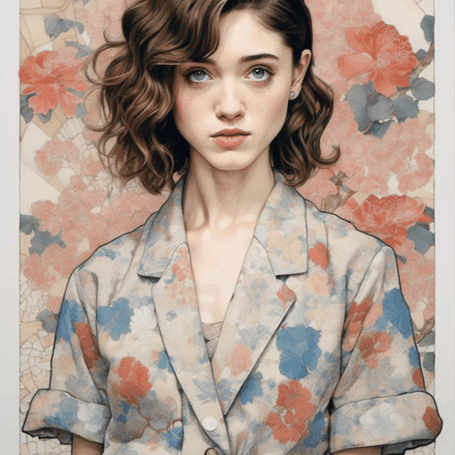
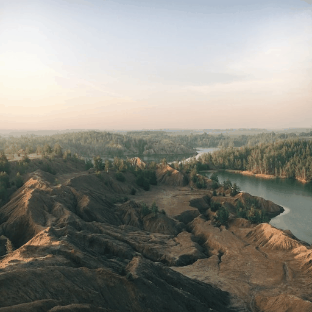
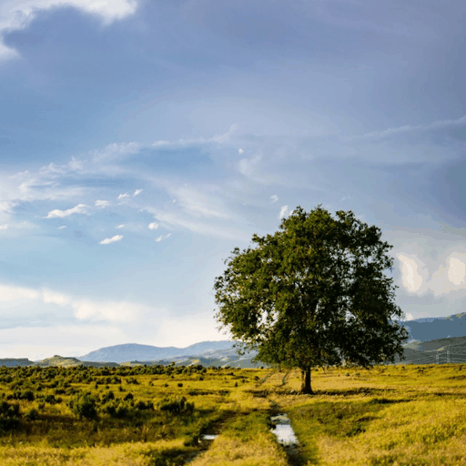

<p align="center">

  <h1 align="center">The Blessing of Randomness: SDE Beats ODE in General Diffusion-based Image Editing</h1>
    <div style="display: flex; justify-content: center; flex-wrap: wrap;">
        
        
        
        
        
        
        
        
    </div>
    <p align="center">
      
      
      
    </p>
  <p align="center">
    <a href="https://drive.google.com/file/d/1W0zA20UVKnakaCIVpFcbabcdb4XmDcMz/view?usp=drive_link"></a>
    <a href="https://ml-gsai.github.io/SDE-Drag-demo/"></a>
  </p>
</p>

## :hammer_and_wrench: Dependency

```sh
conda create -n sdedrag python=3.9
conda activate sdedrag

pip install torch==2.0.0 torchvision transformers
pip install diffusers==0.21.4 accelerate gradio opencv-python
```

The pre-trained model of all experiments employed in this repo is [runwayml/stable-diffusion-v1-5](https://huggingface.co/runwayml/stable-diffusion-v1-5).

## :star: SDE-Drag

### GUI

To start the SDE-Drag GUI, simply run:

```angular2html
python sdedrag_ui.py
```

We provide a [GIF tutorial](https://github.com/NieShenRuc/SDE-Drag-backup/blob/master/assets/tutorial/tutorial-short.gif) for our GUI.
Moreover, the GUI interface offers comprehensive step-by-step instructions.

Generally, the usage of the SDE Drag GUI follows below steps:

1. Upload image, draw a mask (optional), and add the source and target points;

2. Choose whether to perform LoRA finetuning and give a prompt that describe the desire editing image;

3. Click the "Run" button, and the rightmost canvas will display dragging trajectory. Wait until the "State" text box shows "Drag Finish".

Upon running the SDE-Drag process, it saves data items including `origin_image.png` (origin image), `input_image.png` (origin image with mask, source and target points on it), `mask.png`, and `prompt.json` (point coordinates and prompt). All these files are stored in `drag_data/(user-input Output path).` If you enable LoRA finetuning, the LoRA model is placed in `(user-input LoRA path)/(user-input Output path)`.
The entire dragging trajectory is saved under `output/(user-input Output path)`.

- **Using Tips**

1. Prompt: A prompt described the target ediitng image is often more effective than one referencing the original image.

2. LoRA Finetuning: It typically improves outcomes but isn't always required.
Use it if dragging changes the main subject, like a cat turning into another cat. 
If the edit simply replicates the original, indicating overfitting, skip finetuning.

3. Masks: Highlighting areas you want to remain unchanged with a mask can improve your editing outcome.

### Evaluation on DragBench

Download [DragBench](https://drive.google.com/file/d/1YdYareZqFghwUcADrCsJVHr9iBRm_q8Y/view?usp=drive_link), unzip and place into the project, then simply run:

```angular2html
python sdedrag_dragbench.py
```

All the editing results will be put into `output/sdedrag_dragbench`.

## :bulb: More image editing

### Cycle-SDE

We provide a script to explore the reconstruction capability of Cycle-SDE.

```angular2html
python cycle_sde.py

optional arguments:
    --seed          random seed
    --steps         sampling steps
    --scale         classifier-free guidance scale
    --float64       use double precision
```

The origin image is `assets/origin.png` and the reconstruction will be put into `output/cycle_sde_reconstruction`.

### Inpainting

Do inpainting with an ODE solver (inpainting-ODE) or a SDE solver (inpainting-SDE).

```angular2html
python inpainting.py         # inpainting-ODE
python inpainting.py  --sde  # inpainting-SDE
```

The inpainting results will be put into`output/inpainting`. We also provide other supported arguments of inpainting:

```angular2html
    --seed          random seed
    --img_path      directory including origin.png and mask.png
    --steps         sampling steps
    --order         solver order
                        order=1: DDIM(ODE) or DDIM(SDE)
                        order=2: DPM-Sover++(ODE) or SDE-DPM-Solver++(SDE)
```

### DiffEdit

Employ [DiffEdit](https://arxiv.org/abs/2210.11427) with an ODE solver (DiffEdit-ODE) or and SDE solver (DiffEdit-SDE)

```angular2html
python diffedit.py         # DiffEdit-ODE
python diffedit.py  --sde  # DiffEdit-SDE
```

The DiffEdit results will be put into`output/diffedit`. We also provide other supported arguments of DiffEdit:

```angular2html
    --seed          random seed
    --img_path      origin image path
    --source_prompt prompt described the origin image
    --target_prompt prompt described the targte editing
    --steps         discretize [0, T] into <steps> steps
    --scale         classfier-free guidance scale
    --encode_ratio  encode ration in DiffEdit, t_0 in our paper
```

## :label: TODO

- [ ] Optimize inference speed.
- [ ] Improve SDE-Drag UI.
- [ ] Support more base model.
- [ ] Integrated into diffusers and stable diffusion WebUI.

## :hearts: Acknowledgement

This project is heavily based on the [Diffusers](https://github.com/huggingface/diffusers) library.
Our SDE-Drag UI design is inspired by [DragDiffusion](https://github.com/Yujun-Shi/DragDiffusion). Thanks for their great work!


