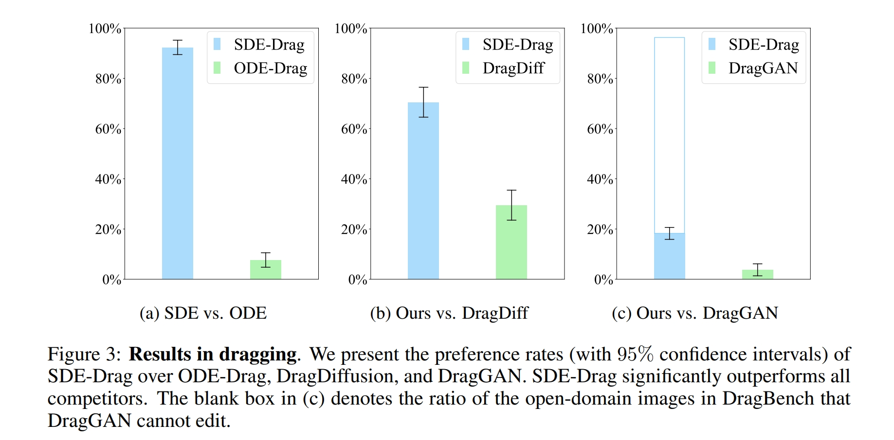
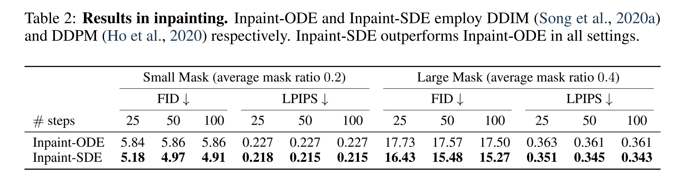
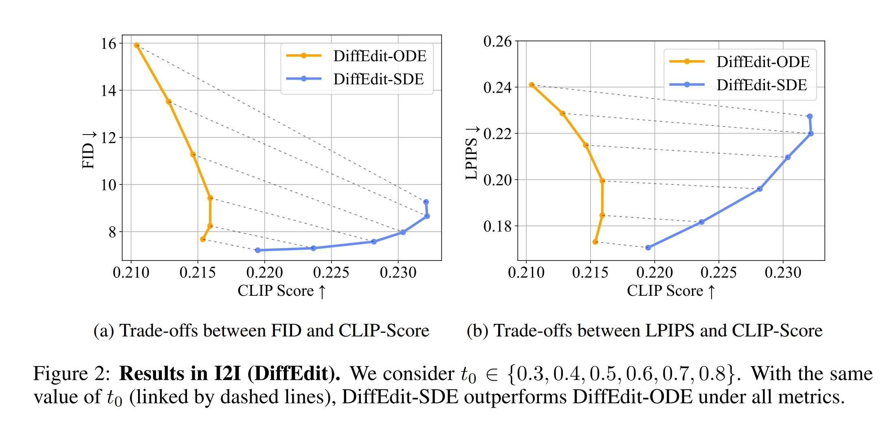

<p align="center">

  <h1 align="center">The Blessing of Randomness: SDE Beats ODE in General Diffusion-based Image Editing</h1>
    <div style="display: flex; justify-content: center; flex-wrap: wrap;">
        
        
        
        
        
        
        
        
    </div>
    <p align="center">
      
      
      
    </p>
  <p align="center">
    <a href="http://arxiv.org/abs/2311.01410"></a>
    <a href="https://ml-gsai.github.io/SDE-Drag-demo/"></a>
  </p>
</p>

## :label: News!
- [2024.1.16] Our paper is accepted by **ICLR2024**!
- [2024.2.25] Optimize inference speed. Only **about 70% of the time to drag an image** compared to the original paper.
- [2024.2.25] Integration with **Diffusers library**.

## :hammer_and_wrench: Dependency

```sh
conda create -n sdedrag python=3.9
conda activate sdedrag

pip install torch==2.0.0 torchvision transformers
pip install diffusers==0.25.1 accelerate gradio opencv-python
```

The pre-trained model of all experiments employed in this repo is [runwayml/stable-diffusion-v1-5](https://huggingface.co/runwayml/stable-diffusion-v1-5).

## 🤗 **Integration with Diffusers library**
You can try out SDE-Drag with just a couple lines of code:
```python
import PIL
import torch
from diffusers import DDIMScheduler, DiffusionPipeline

# Load the pipeline
model_path = "runwayml/stable-diffusion-v1-5"
scheduler = DDIMScheduler.from_pretrained(model_path, subfolder="scheduler")
pipe = DiffusionPipeline.from_pretrained(model_path, scheduler=scheduler, custom_pipeline="sde_drag")
pipe.to('cuda')

# Provide prompt, image, mask image, and the starting and target points for drag editing.
prompt = "Polar bear standing on the ice, waving to everyone"
image = PIL.Image.open('assets/drag/origin_image.png')
mask_image = PIL.Image.open('assets/drag/mask.png')
source_points = [[145, 216]]
target_points = [[146, 144]]

# train_lora is optional, and in most cases, using train_lora can better preserve consistency with the original image.
# If training LoRA, please use torch.float16 to save GPU memory
# If NOT training LoRA, please avoid using torch.float16
pipe.to(torch.float16)
pipe.train_lora(prompt, image)

# Please see [https://github.com/huggingface/diffusers/blob/main/examples/community/sde_drag.py#L63] for more hyper-parameters
output = pipe(prompt, image, mask_image, source_points, target_points)
output_image = PIL.Image.fromarray(output)
output_image.save("./output.png")
```

## :star: SDE-Drag

### GUI

To start the SDE-Drag GUI, simply run:

```angular2html
python sdedrag_ui.py
```

We provide a [GIF tutorial](https://github.com/NieShenRuc/SDE-Drag-backup/blob/master/assets/tutorial/tutorial-short.gif) for our GUI.
Moreover, the GUI interface offers comprehensive step-by-step instructions.

Generally, the usage of the SDE Drag GUI follows below steps:

1. Upload image, draw a mask (optional), and add the source and target points;

2. Choose whether to perform LoRA finetuning and give a prompt that describe the desire editing image;

3. Click the "Run" button, and the rightmost canvas will display dragging trajectory. Wait until the "State" text box shows "Drag Finish".

Upon running the SDE-Drag process, it saves data items including `origin_image.png` (origin image), `input_image.png` (origin image with mask, source and target points on it), `mask.png`, and `prompt.json` (point coordinates and prompt). All these files are stored in `drag_data/(user-input Output path).` If you enable LoRA finetuning, the LoRA model is placed in `(user-input LoRA path)/(user-input Output path)`.
The entire dragging trajectory is saved under `output/(user-input Output path)`.

- **Using Tips**

1. Prompt: A prompt described the target ediitng image is often more effective than one referencing the original image.

2. LoRA Finetuning: It typically improves outcomes but isn't always required.
Use it if dragging changes the main subject, like a cat turning into another cat. 
If the edit simply replicates the original, indicating overfitting, skip finetuning.

3. Masks: Highlighting areas you want to remain unchanged with a mask can improve your editing outcome.

### Evaluation on DragBench

Download [DragBench](https://drive.google.com/file/d/1YdYareZqFghwUcADrCsJVHr9iBRm_q8Y/view?usp=drive_link), unzip and place into the project, then simply run:

```angular2html
python sdedrag_dragbench.py
```

All the editing results will be put into `output/sdedrag_dragbench`.

<details open>
<summary><font size="4">
Results in Dragging
</font></summary>

</details>

### Highlight
we highlight that SDE-Drag can improve the alignment between the prompt and 
sample from advanced AI-painting systems like Stable Diffusion and DALL·E 3.

<div style="display: flex; justify-content: center; flex-wrap: wrap;">
    
    
    
</div>

The image on the far left was created by DALL·E 3 with the prompt: 
*"A 3D render of a coffee mug placed on a window sill during a stormy day. 
The storm outside the window is reflected in the coffee, with miniature 
lightning bolts and turbulent waves seen inside the mug. The room is dimly 
lit, adding to the dramatic atmosphere."* However, as we can observe, there 
are no lightning bolts in the coffee. In this case, we can employ SDE-Drag 
to introduce lightning bolts into the coffee mug, thus achieving a closer 
match to the provided prompt.


## :bulb: More image editing

### Cycle-SDE

We provide a script to explore the reconstruction capability of Cycle-SDE.

```angular2html
python cycle_sde.py

optional arguments:
    --seed          random seed
    --steps         sampling steps
    --scale         classifier-free guidance scale
    --float64       use double precision
```

The origin image is `assets/origin.png` and the reconstruction will be put into `output/cycle_sde_reconstruction`.

### Inpainting

Do inpainting with an ODE solver (inpainting-ODE) or an SDE solver (inpainting-SDE).

```angular2html
python inpainting.py         # inpainting-ODE
python inpainting.py  --sde  # inpainting-SDE
```

The inpainting results will be put into`output/inpainting`. We also provide other supported arguments of inpainting:

```angular2html
    --seed          random seed
    --img_path      directory including origin.png and mask.png
    --steps         sampling steps
    --order         solver order
                        order=1: DDIM(ODE) or DDIM(SDE)
                        order=2: DPM-Sover++(ODE) or SDE-DPM-Solver++(SDE)
```

<details open>
<summary><font size="4">
Results in inpainting
</font></summary>

</details>

### DiffEdit

Employ [DiffEdit](https://arxiv.org/abs/2210.11427) with an ODE solver (DiffEdit-ODE) or an SDE solver (DiffEdit-SDE)

```angular2html
python diffedit.py         # DiffEdit-ODE
python diffedit.py  --sde  # DiffEdit-SDE
```

The DiffEdit results will be put into`output/diffedit`. We also provide other supported arguments of DiffEdit:

```angular2html
    --seed          random seed
    --img_path      origin image path
    --source_prompt prompt described the origin image
    --target_prompt prompt described the targte editing
    --steps         discretize [0, T] into <steps> steps
    --scale         classfier-free guidance scale
    --encode_ratio  encode ration in DiffEdit, t_0 in our paper
```

<details open>
<summary><font size="4">
Results in DiffEdit
</font></summary>

</details>

## :hearts: Acknowledgement

This project is heavily based on the [Diffusers](https://github.com/huggingface/diffusers) library.
Our SDE-Drag UI design is inspired by [DragDiffusion](https://github.com/Yujun-Shi/DragDiffusion). Thanks for their great work!


## :black_nib: Citation

```bibtex
@article{nie2023blessing,
  title={The Blessing of Randomness: SDE Beats ODE in General Diffusion-based Image Editing},
  author={Nie, Shen and Guo, Hanzhong Allan and Lu, Cheng and Zhou, Yuhao and Zheng, Chenyu and Li, Chongxuan},
  journal={arXiv preprint arXiv:2311.01410},
  year={2023}
}
```
